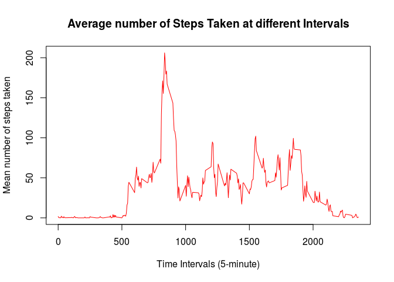
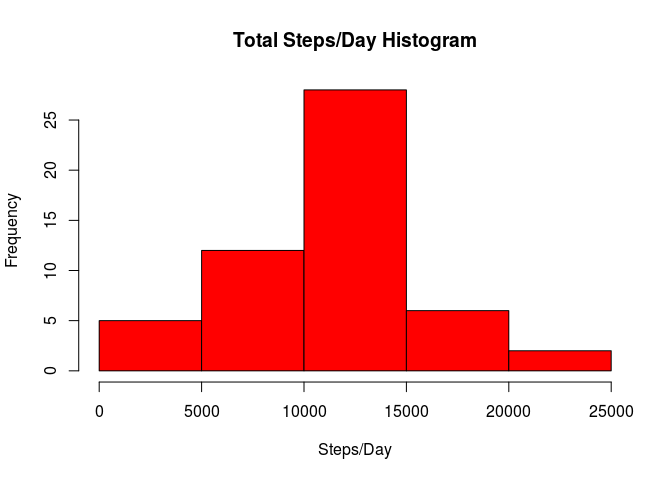
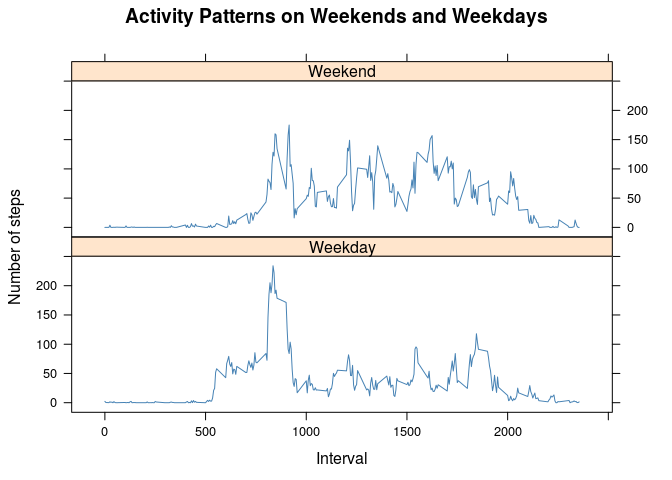

# Reproducible Research: Peer Assessment 1

## Loading and preprocessing the data
1. Load the data

```r
activ <- read.csv("activity.csv")
```
2. Process the date

```r
activ$date <- as.Date(activ$date,"%Y-%m-%d")
#summary(activ)
activ.stepsums <- aggregate(steps~date, data=activ, na.rm=TRUE, FUN=sum)
#summary(stepsums)
```

## What is mean total number of steps taken per day?
1. Make a histogram of the total number of steps taken each day

```r
hist(activ.stepsums$steps, col="red", xlab="Steps/Day", ylab="Frequency", main="Total Steps/Day Histogram")
```

 

# Calculate and report the mean and median total number of steps taken per day


The __MEAN__ total number of steps taken per day is 1.0766 &times; 10<sup>4</sup>.

The __MEDIAN__ total number of steps taken per day is 10765.


## What is the average daily activity pattern?

1. Make a time series plot (i.e. type = "l"`) of the 5-minute interval (x-axis) and the average number of steps taken, averaged across all days (y-axis)

```r
activ.stepmean <- aggregate(steps~interval,data=activ,FUN=mean,na.rm=TRUE)
plot(steps~interval,data=activ.stepmean,type="l", col="red",
xlab="Time Intervals (5-minute)",
ylab="Mean number of steps taken",
main="Average number of Steps Taken at different Intervals")
```

 

2. Which 5-minute interval, on average across all the days in the dataset, contains the maximum number of steps?
The 835 contains the maximum number of steps.

## Imputing missing values

1. Calculate and report the total number of missing values in the dataset (i.e. the total number of rows with NAs)

```r
sum(is.na(activ$steps))
```

```
## [1] 2304
```

2. Devise a strategy for filling in all of the missing values in the dataset. The strategy does not need to be sophisticated. For example, you could use the mean/median for that day, or the mean for that 5-minute interval, etc.

I want to fill NA'values by mean step numper of current day

3.Create a new dataset that is equal to the original dataset but with the missing data filled in.

```r
step_day_mean <- aggregate(steps~date,data=activ,mean,na.action = na.pass)
#step_day_mean$steps[is.na(step_day_mean$steps)] <- 0
step_day_mean$steps <- as.integer(step_day_mean$steps)

activ_imp <- merge(activ, step_day_mean, by="date")
activ_imp$steps.x[is.na(activ_imp$steps.x)] <- activ_imp$steps.y[is.na(activ_imp$steps.x)]
activ_imp$steps.y<-NULL
activ_imp <- activ_imp[c(2, 1, 3)]
names(activ_imp) <- names(activ)
```
4. Make a histogram of the total number of steps taken each day and Calculate and report the mean and median total number of steps taken per day. Do these values differ from the estimates from the first part of the assignment? What is the impact of imputing missing data on the estimates of the total daily number of steps?


```r
activ_imp.stepsums <- aggregate(steps~date, data=activ_imp, na.rm=TRUE, FUN=sum)
hist(activ_imp.stepsums$steps, col="red", xlab="Steps/Day", ylab="Frequency", main="Total Steps/Day Histogram")
```

 

The __MEAN__ total number of steps in original dataset is 1.0766 &times; 10<sup>4</sup>.

The __MEAN__ total number of steps in improved dataset is 1.0766 &times; 10<sup>4</sup>.

The __MEDIAN__ total number of steps in original dataset is 10765.

The __MEDIAN__ total number of steps in improved dataset is 10765.

As we can see, there are no significant changes between original and improved datasets.

## Are there differences in activity patterns between weekdays and weekends?

```r
activ_imp$days <- weekdays(as.Date(activ_imp$date), TRUE)
activ_imp$day_t <- ifelse(activ_imp$days == "Sat" | activ_imp$days == "Sun", "Weekend", "Weekday")
activ_imp.stepmean <- aggregate(steps~interval+day_t,data=activ_imp,FUN=mean,na.rm=TRUE)
```

## Loading required package: lattice and create plot.


```r
library(lattice)
xyplot(steps ~ interval | day_t, activ_imp.stepmean, type = "l", layout = c(1, 2), xlab = "Interval", ylab="Number of steps", main = "Activity Patterns on Weekends and Weekdays", col = "steelblue")
```

 
